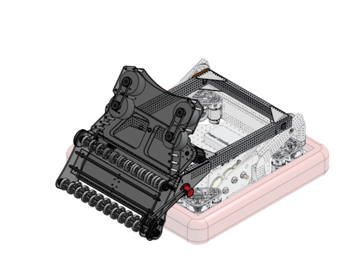
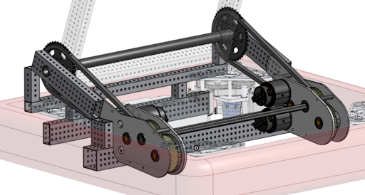

# Arm

## **Overview**

The Arm refers to the mechanism on the robot that holds [Peter](peter.md) (the shooter) and changes its angle. It includes four motors, two gearboxes, two chain reductions, an absolute encoder, and the two metal arms (to which Peter is attached).

### Range of Motion

- The arm moves in a range from horizontal (0 degrees) to vertical (around 90 degrees).
- There are different preset angles for the arm to go to, depending on the task.
  - The rest position (default position) is 20 degrees.
  - The intake position is 4 degrees.
  - The amp position (angle for scoring into the Amp) is 78 degrees.
  - The speaker position (angle for scoring into the Speaker) is calculated automatically, and ranges from around 0 to 55 degrees.
- At the start of each round, the arm has to start at a certain angle (around 50 degrees) in order to keep Peter inside the robot starting boundary. The arm is lifted to this position by people before the robot is enabled.

### Design

- The arm is driven by 4 motors, 2 for each side of the arm.
- The 2 motors on each side are meshed to a gearbox, which exchanges speed for torque, allowing the motors to lift the heavy arm.
- The gearboxes are connected to the actual arm using two chains, whose gear ratio also exchanges speed for torque.
- On the last gear of one of the gearboxes, there is an absolute encoder. It is used to detect what angle the arm is at when the robot is enabled, but after enabling it is no longer used throughout the match.

## **Programming**

The Arm is moved and controlled by turning the four arm motors. Only one motor (the Top Left motor) is controlled, and the other three motors follow this motor.

The main interface for controlling the Arm is the **ArmSubsystem**, and there is a set of commands that set the Arm's angle to specific values.

### ArmSubsystem.java

The Arm is controlled mainly from `ArmSubsystem.java`. This subsystem has a variable called `targetDegrees`, and on its own, the subsystem constantly moves the motors so that the Arm's angle is at `targetDegrees`. Most methods in this subsystem simply set the value of `targetDegrees` to some constant angle, a given angle, or a calculated angle.

#### *Methods*

The main methods of this subsystem are:

- `public void setTargetDegrees(double angleDegrees) {...}` - This sets the ArmSubsystem's `targetDegrees` variable to `angleDegrees`, clamped between 4 and 90 degrees.
- `public void rotateArmToSpeakerPosition(Translation2d robotPosition) {...}` - This uses `robotPosition` to find the robot's distance from the target Speaker on the field, and uses that to calculate the angle the arm needs to be at to score into the Speaker. The `targetDegrees` variable is then updated to this angle.
- `public void rotateToAmpPosition() {...}` - This sets the `targetDegrees` variable to a constant, so that the arm is at the right angle to score into the Amp on the field.
- `public void rotateToRestPosition() {...}` - This sets the `targetDegrees` variable to a constant, so that the arm is slightly above horizontal, and is at the right angle to outtake the note in Peter.
- `public double getCorrectedDegrees() {...}` - This calculates and returns the current angle the arm is at, in degrees. Since the motor encoders read an angle of slightly above 0 when the arm is horizontal, this function corrects the reading so that it returns 0 degrees when the arm is horizontal.
- `public boolean atTarget(double tolerance) {...}` - This returns `true` if the Arm's current angle is at `targetDegrees` (plus or minus `tolerance`), and returns `false` otherwise.

So, `ArmSubsystem.java` is the main interface for controlling the Arm. It allows for the Arm's angle to be set to a preset angle, to a calculated Speaker angle, or to any arbitrary angle (4 to 90 degrees). It also allows to check what angle the Arm is at, and whether or not the Arm has reached its `targetDegrees` angle.

#### *Initialization*

On initialization, the ArmSubsystem performs a number of steps before it can be used. These steps are:

1. Create a new `CurrentLimitsConfigs` object, with a constant Current Limit, to be applied to the four motors.
2. Create a new `MotorOutputConfigs` object, with Neutral Mode set to Brake, to be applied to the four motors.
3. Create a new `Slot0Configs` object, with a constant **P** value for PID, to be applied to the four motors.
4. Create a new `ArmFeedforward` object, with constant **S**, **G**, and **V** values, to be applied to the four motors.
5. Initialize the four `TalonFX` motor objects, using constants for the device IDs and the CANBus name.
6. Create two `Follower` objects that follow the Top Left motor, with one of the Followers set to opposite direction.
7. Apply the correct Follower objects to the remaining three motors.
8. Apply the MotorOutputConfigs and the CurrentLimits to the four motors.
9. Create a `TalonFX` variable called **master**, and assign it to the Top Left motor.
10. Apply the Slot0Configs to the master motor.
11. Create a new `MotionMagicConfigs` object with constant Cruise Velocity and Acceleration values, and apply it to the master motor.
12. Initialize a new `DutyCycleEncoder` object called **revEncoder**, with a constant Encoder Port, representing the Arm's **Absolute Encoder**.
13. In a new Thread: Wait until revEncoder is connected. Once it is, set the master motor's Encoder reading to revEncoder's position, converted to motor rotations using a constant conversion factor. Then, set the **initialized** variable to true, and initialize the **armHorizontalOffset** variable to the Absolute Horizontal Offset constant, converted to arm rotations using a constant conversion factor.
14. Finally, set the `targetDegrees` variable to the constant Default Arm Angle, which is **20 degrees**.

### Arm Commands

There are five or six commands that control the Arm, and most of them utilize the ArmSubsystem. Each command uses the methods inside ArmSubsystem to set the angle of the arm.

Here are the commands that control the arm:

- **AimArmAtAmpCmd** - Sets the angle of the arm to a constant, so that the robot can score a note into the Amp. In execute(), it runs `armSubsystem.rotateToAmpPosition()`, and it finishes when `armSubsystem.atTarget(1)` returns true in isFinished().
- **AimArmCmd** - Aims the arm at the Speaker, so that when a note is shot, it will make it into the Speaker. In execute(), it runs `armSubsystem.rotateToSpeaker(swerveSubsystem.getState().Pose.getTranslation())`, which calculates the correct arm angle inside ArmSubsystem using the given robot Translation2d. It finishes when the arm is at the calculated target angle by running `armSubsystem.atTarget(1)` in isFinished().
- **ArmToAngleCmd** - Sets the angle of the arm to a given angle, using a Supplier. It runs `arm.setTargetDegrees(angle.get())` in execute(), with `angle` being the angle Supplier, and doesn't stop on its own. When the command finishes, it returns the arm to the rest position by running `arm.rotateToRestPosition()` in end().
- **ArmToNeutralCmd** - Sets the angle of the arm to the Neutral position by running `armSubsystem.rotateToRestPosition()` in execute(), and it finishes when the arm is at the target angle by running `armSubsystem.atTarget(1)` in isFinished().
- **ArmToPickupCmd** - Sets the angle of the arm to the Intake position by running `armSubsystem.setTargetDegrees(Constants.Arm.INTAKE_ANGLE)` in execute(), and it finishes when the arm is at the target angle by running `armSubsystem.atTarget(2)` in isFinished().
- **AimAtSpeaker** - This is a Parallel Command Group. At the same time, it spins up the shooter flywheels, 
