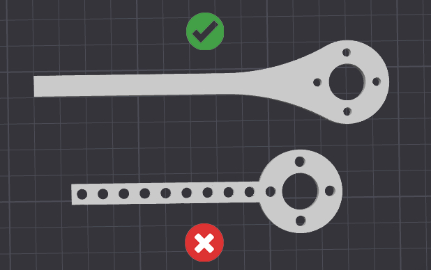

# Mechanical

## [Game Manual 0](https://gm0.org/en/latest/) is a very useful resource

## Parts

* We use [goBilda](https://www.gobilda.com/) parts almost exclusively
  * For the drivebase, we use the [goBilda Strafer kit with 96mm mecanum wheels](https://www.gobilda.com/strafer-chassis-kit-96mm-mecanum-wheels/)
    * The dimensions of the drivebase can be modified, and the motors cam be mounted either horizonally or vertically
  * goBilda parts use M4 screws
    * Button head screws use a 2.5mm hex key
    * Socket head screws use a 3mm hex key
  * D-shafts are outdated and should not be used unless absolutely necessary
* You should use nyloc nuts(nuts with nylon inserts) if possible in order to reduce the chance of them coming loose

## General Mechanical Informations

* The higher a motor's RPM is, the lower the torque it has - if you need a lot of force from a motor(i.e. for lifting the robot), you should use a lower RPM motor

## CAD(Computer Aided Design)

* For modeling robots and parts in CAD(3D) we us Onshape. You can sign up for a free education account [here](https://www.onshape.com/en/education/)
* goBilda and REV parts can usually be found in the "insert" menu by searching the product SKU#, available on the product page for the specific part/assembly
  * If you can't find it, goBilda provides STEP files for their parts
* If you design parts for 3D printing, make sure to round inside corners, which can be done using the fillet tool

